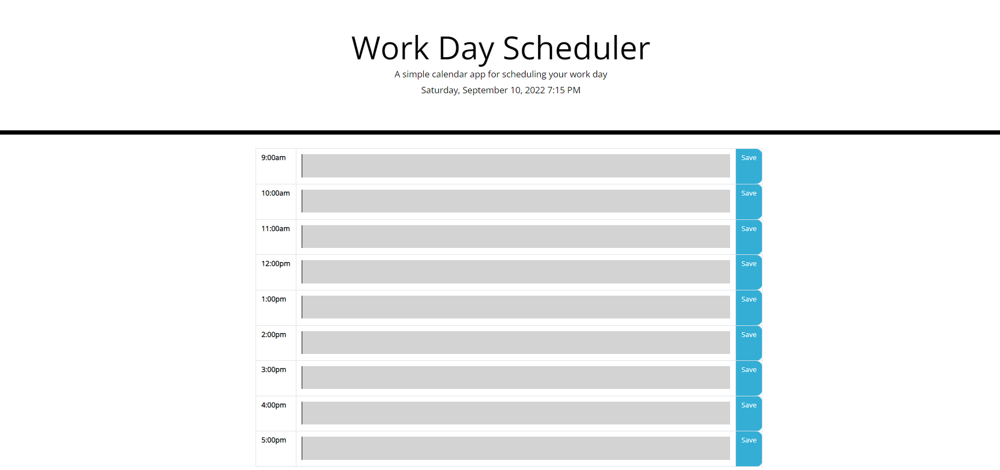

# Work Day Scheduler - Challenge 5

# Description

The goal of this challenge was to have us use third party APIS to create an interactive work day scheduler. We were given starter code and the expected behavior for our workday scheduler. From there, it was up to us to render the slots for each hour of the day and to use moment.js to write a function whereby the past hours of the current day were shown in gray, the present hour in red, and upcoming hours in green. I was able to achieve several of the items and am beginning to get a firmer grasp on where my areas for clairification and improvement. I need to establish a workflow that will help me keep my processes organized and efficient while writing this type of foundational code. I need to invest more fully in the Agile development mentality. For all my frustration, I'm excited to get better at this.

# LIVELINK

[LIVE LINK](https://tyleresselman.github.io/work-day-scheduler-ch-5/)

# Screenshot of page

# Credits

Took advice from instructor Poornima and TA Sam Adams on logical elements and best practices.

# License

The MIT License (MIT)